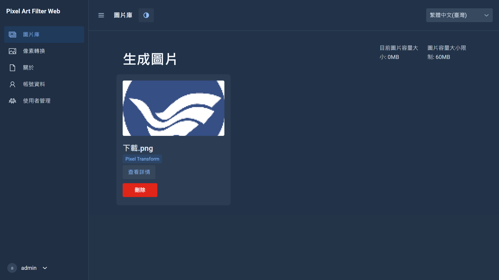

# Pixel Art Filter Web Java Version

[](https://github.com/keke125/pixel-art-filter-web/actions/workflows/maven-docker.yml)
[](https://app.codacy.com/gh/keke125/pixel-art-filter-web/dashboard?utm_source=gh&utm_medium=referral&utm_content=&utm_campaign=Badge_grade)
[](https://snyk.io/test/github/keke125/pixel-art-filter-web)

[](https://github.com/keke125/pixel-art-filter-web/releases/latest)


Pixel Art Filter Web Java Version 為免費且開放原始碼的跨平臺網頁程式，提供使用者不同風格的像素濾鏡轉換功能。

## 簡介

本專案為`Vaadin`應用程式，使用`Spring Boot`框架，為`Pixel Art Filter`的`Java`網頁版本，程式使用的`OpenCV`像素濾鏡轉換程式碼由 JingShing 提供，可參考其 GitHub 專案 [JingShing/Pixel-Art-Filter-Java](https://github.com/JingShing/Pixel-Art-Filter-Java) 。

程式提供使用者上傳圖片、透過設定轉換參數為圖片套上不同風格的像素濾鏡，原始圖片及轉換後的效果圖將儲存於伺服器，供使用者檢視及下載，此外程式具備管理功能，系統管理員可透過網頁進行管理，例如: 檢視及更新使用者資訊、刪除使用者、設定使用者的圖片容量限制，此外，管理員也可透過修改設定檔，設定網站說明文字。

我們提供官方版本 [pafw.eu.org](https://pafw.eu.org) ，你也可以選擇自行部署到自己的伺服器，以確保資料的自主性，同時也可以自定義各種設定，例如: 監聽的連接埠，密碼選用哪種方式雜湊，上傳檔案的限制，我們推薦使用 Docker 部署。

## Demo

[pafw.eu.org](https://pafw.eu.org) 由`Pixel Art Filter Web`官方維護，提供使用者 Demo。  
測試使用者的資訊為帳號: `test` / 密碼: `testtest`，你也可以另外註冊使用帳號。

Demo 伺服器託管於 OVH 俄勒岡機房，使用 Cloudflare CDN 加速。  


## 技術

### 程式語言、框架、函式庫、專案管理、外部函式庫、資料庫
      

### 版本控制、CI/CD
  

### 支援的作業系統、容器化、網頁伺服器
   

## 授權條款
[](LICENSE)

## 程式截圖

檢視儲存圖片


檢視圖片資訊


設定圖片轉換參數


使用者管理

## 組建

本專案為`Maven`專案，請參考以下指令組建。

1. 下載專案  
  ```bash
  git clone https://github.com/keke125/pixel-art-filter-web.git
  ```
2. 移動至專案根目錄  
  ```bash
  cd pixel-art-filter-web
  ```
3. 使用 `mvnw` 組建

    * Windows CMD
    ```bash
    mvnw clean package -Pproduction
    ```

   * Windows PowerShell
    ```bash
    .\mvnw clean package -Pproduction
    ```

   * Mac & Linux
    ```bash
    ./mvnw clean package -Pproduction
    ```

此時在`target`資料夾底下，你會找到製作好的`Jar`檔案，接著請參考 [部署至Linux伺服器](#部署至Linux伺服器)
章節。

如果想將專案導入 IDE ，你也可以參考 [how to import Vaadin projects to different IDEs](https://vaadin.com/docs/latest/getting-started/import) ( Eclipse, IntelliJ IDEA, NetBeans, and VS Code )。

## 檔案結構

<pre>
.
└── pafw
    ├── application.properties
    ├── pixel-art-filter-web-1.x.x.jar
    └── opencv_java460.dll (Windows) / libopencv_java460.so (Linux) (Optional)
</pre>

## 部署至Linux伺服器

### 一般部署

#### 下載程式
請根據作業系統及處理器架構調整下載連結。

- 使用`wget`下載
```bash
wget https://github.com/keke125/pixel-art-filter-web/releases/download/v1.1.x/pafw-1.1.x-linux-amd64.tar.gz
```

- 或是透過瀏覽器至 [GitHub Release](https://github.com/keke125/pixel-art-filter-web/releases/latest) 下載

#### 解壓縮到指定路徑

解壓縮檔案至指定的路徑 ，請確認程式放置的路徑，並進入該資料夾。

⚠️ 由於圖片儲存為絕對路徑，移動程式資料夾將導致讀取圖片錯誤 (如有移動資料夾的需求，可改用Docker部署)。

⚠️ 絕對路徑中不可出現中文。

```bash
tar -xzvf pafw-1.1.x-linux-amd64.tar.gz -C /path/to/application
```

```bash
cd pafw-1.1.x-linux-amd64
```

#### 建立資料庫

本專案使用 `MariaDB`，你也可以改成你喜歡的資料庫，請參考 `Spring Data JPA` 相關設定。

為了使程式能夠持久儲存資料，請先進入`MariaDB`客戶端，參考以下指令新增資料庫，其中`newdatabase`為資料庫名稱，`newdatabaseuser`為資料庫使用者，`password`為資料庫使用者密碼。

```mariadb
CREATE DATABASE newdatabase CHARACTER SET utf8mb4 COLLATE utf8mb4_general_ci;
CREATE USER 'newdatabaseuser'@'localhost' IDENTIFIED BY 'password';
GRANT ALL PRIVILEGES ON newdatabase.* TO 'newdatabaseuser'@'localhost';
FLUSH PRIVILEGES;
```

#### 設定資料庫連線資訊

新增資料庫後，請設定資料庫連線資訊，你可以選擇設定環境變數，或是修改設定檔。

##### 使用環境變數

- PAFW_DB_URL  
資料庫路徑，例如: `jdbc:mariadb://localhost:3306/pafw`，其中`pafw`為資料庫名稱。
- PAFW_DB_USER  
資料庫使用者，例如: `newdatabaseuser`。
- PAFW_DB_PASSWORD  
資料庫使用者密碼，例如: `password`。

##### 修改設定檔

請修改`application.properties`，並設定下列參數。

- spring.datasource.url  
資料庫路徑，例如: `jdbc:mariadb://localhost:3306/pafw`，其中`pafw`為資料庫名稱。
- spring.datasource.username  
資料庫使用者，例如: `newdatabaseuser`。
- spring.datasource.password  
資料庫使用者密碼，例如: `password`。

#### 調整設定檔 (可選)

如需額外設定，請參考 [設定檔](#設定檔) 章節。

#### 執行程式

```bash
java -jar pixel-art-filter-web-1.x.x.jar
```

接著請在瀏覽器開啟 http://localhost:8080 ，如果你有調整監聽連接埠，請將`8080`
換成你自訂的連接埠。

初始的管理員帳號密碼為`admin/admin`

⚠️ 登入後請盡速至帳號資料更改理員密碼。  
⚠️ 使用者的圖片計算將只計算使用者上傳的圖片，經轉換後的圖片大小並不會被計入，根據實測，通常轉換後的圖片都不會太大。

### Docker部署

請參考 [Docker Hub](https://hub.docker.com/r/keke125/pixel-art-filter-web) 。

### 關於OpenCV(可選)

本專案使用的`OpenCV`版本為`4.6.0`，使用 [openpnp/opencv](https://github.com/openpnp/opencv) 製作後的依賴，你也可以改為使用`OpenCV`官方提供的依賴，請參考以下步驟。

#### 取得OpenCV安裝檔案

- Linux  
在Linux的環境下你需要編譯`OpenCV`，編譯後取得`opencv-460.jar`及`libopencv_java460.so`兩個檔案，如果你需要編譯`OpenCV`的指令，你可以參考 [docker-linux-install.sh](opencv/docker-linux-install.sh)  (適用於`Debian`及`Ubuntu`)。


- Windows  
在 Windows 的環境下可至 [OpenCV](https://opencv.org/releases/) 官網下載，包含`opencv-460.jar`及`opencv_java460.dll`兩個檔案。

#### 將Jar檔加入Maven專案
取得檔案後，輸入以下指令將`OpenCV`加入到`Maven`專案，其中`/path/to/opencv/jarfile`需替換成`jar`檔的路徑。

```bash
mvn install:install-file -Dfile=/path/to/opencv/jarfile -DgroupId=org -DartifactId=opencv -Dversion=4.6.0 -Dpackaging=jar
```

並將`pom.xml`當中的
```xml
<!-- https://mvnrepository.com/artifact/org.openpnp/opencv -->
<dependency>
    <groupId>org.openpnp</groupId>
    <artifactId>opencv</artifactId>
    <version>4.6.0-0</version>
</dependency>
```

替換成
```xml
<!-- https://mvnrepository.com/artifact/opencv/opencv -->
<dependency>
    <groupId>org</groupId>
    <artifactId>opencv</artifactId>
    <version>4.6.0</version>
</dependency>
```

#### 調整程式碼
請調整位於`src/main/java/com/keke125/pixel/data/service/ImageService.java`的程式碼，將`nu.pattern.OpenCV.loadLocally();`替換成`System.loadLibrary(Core.NATIVE_LIBRARY_NAME);`，並於程式開頭加入`import org.opencv.core.Core;`來匯入`OpenCV`。

#### 載入原生函式庫 (native libraries)

##### 開發環境 (使用IDE)
請在 IDE 外部函式庫 (External Libraries) 設定 `OpenCV`。

##### 生產環境 (以`Java`指令執行)
- Windows  
  請指定`.dll`檔的路徑:
```bash
java -Djava.library.path=\path\to\.dll -jar \path\to\.jar
```

- Linux  
  請指定`.so`檔的路徑。
```bash
java -Djava.library.path=/path/to/.so -jar /path/to/.jar
```

請注意，`\path\to\.dll`及`/path/to/.so`需要填的是儲存`.dll`或`.so`的資料夾，`\path\to\.jar`則需填包含`Jar`檔名的完整路徑。

### 設定檔

請根據自身需求設定

- spring.datasource.url  
資料庫路徑，例如: `jdbc:mariadb://localhost:3306/pafw`，其中`pafw`為資料庫名稱。


- spring.datasource.username  
資料庫使用者，例如: `pafw`。


- spring.datasource.password  
資料庫使用者密碼，例如: `changeme`。


- spring.jpa.hibernate.ddl-auto  
如果要在程式停止時刪除資料庫，請使用`create-drop`，適合使用於開發環境；如果要在程式停止時保留資料庫，請使用`update`，適合使用於生產環境。


- spring.servlet.multipart.max-file-size  
如果有調整上傳限制，請一併調整至單次最大上傳檔案總和，例如: `30MB`。


- spring.servlet.multipart.max-request-size  
如果有調整上傳限制，請一併調整至單次最大上傳檔案總和，例如: `30MB`。


- app.maxImageSizeInMegaBytes  
單一檔案最大上傳大小，單位為MB，例如: `10`。


- app.maxImageFiles  
單次上傳的檔案數量上限，例如: `3`。


- app.maxAvatarSizeInMegaBytes  
使用者頭像的大小限制，單位為MB，例如: `3`。


- app.newSignupImageSizeLimit  
使用者註冊時預設的圖片大小總限制，單位為MB，例如: `30`。


- app.idForEncode  
要使用何種演算法雜湊(Hash)使用者的密碼，並將結果存入資料庫，提供`BCrypt`、`pbkdf2`、`argon2`，預設為`argon2`。


- app.webCountry  
網站所在國家。


- app.webNameEN  
英文網站名。


- app.webNameTC  
中文網站名。


- app.webDescriptionEN  
英文網站敘述，於登入頁面顯示。


- app.webDescriptionTC  
中文網站敘述，於登入頁面顯示，請注意，中文須輸入Unicode字碼，如`\u5982`。


- app.webLink  
網站網址，例如: `https://example.com`。


- app.adminContactEmail  
網站管理員聯絡信箱，例如: `admin@example.com`。


- app.loginInfoTC  
中文登入訊息，於登入頁面底部顯示，請注意，中文須輸入Unicode字碼，例如: `\u5982`。


- app.loginInfoEN  
英文登入訊息，於登入頁面底部顯示。

## Nginx 參考設定檔
請根據自身需求修改，例如: 加入`Https`的支援。

```nginx
server {
  listen 80;
  listen [::]:80;
  server_name example.com;

  location / {
  
    proxy_pass http://127.0.0.1:8080;
    proxy_set_header Host $host;
    proxy_set_header X-Real-IP $remote_addr;
    proxy_set_header X-Forwarded-For $proxy_add_x_forwarded_for;
    proxy_set_header X-Forwarded-Proto $scheme;
  
  } 
}
```
## 程式碼行數

